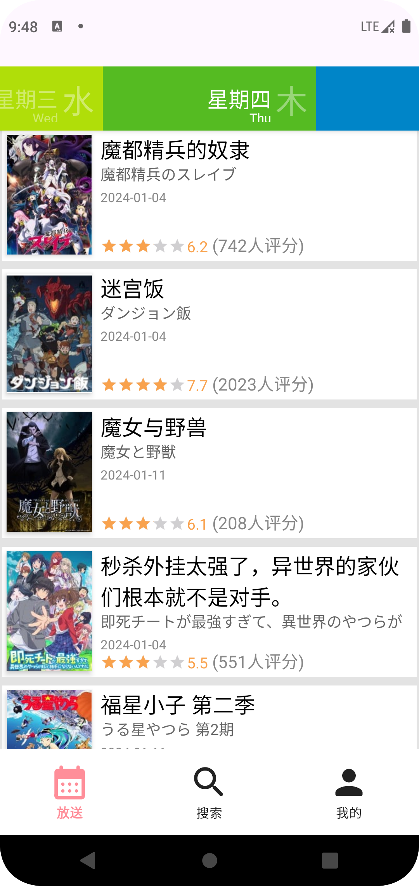
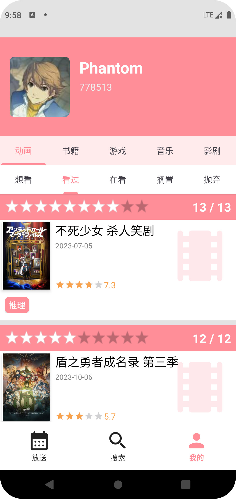

# 番剧笔记

自用[bangumi.tv](https://bangumi.tv)、[bgm.tv](https://bgm.tv)的安卓APP。记录4年前所学的技术的同时方便自己使用，全安卓原生，仅使用了[api.bgm.tv](https://bangumi.github.io/api/)的API，一些功能暂无API支持如评论列表。自认为布局和操作上更符合安卓原生应用的表现与习惯。

已完成大部分查询功能（目录我自己没用过，没去处理）。而新增修改收藏等会修改数据的接口目前说明还不稳定，所以相关功能暂不处理。

## 功能
+ 获取授权
+ 每日放送
+ 搜索（筛选条件：关键词 标签 类型 日期范围 评分范围 排名范围 NSFW）
+ 条目查看
+ 收藏列表

## 截图

