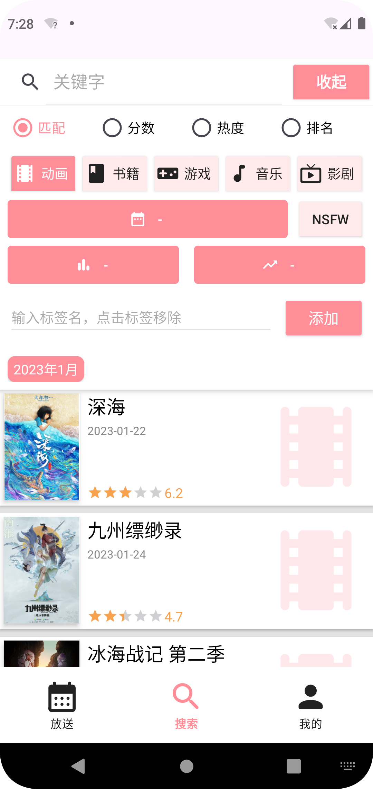
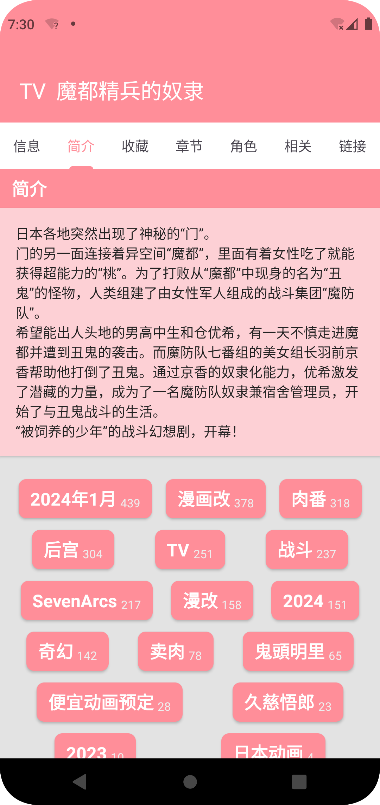
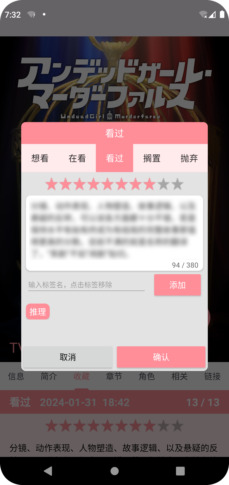

# 番剧笔记

自用[bangumi.tv](https://bangumi.tv)、[bgm.tv](https://bgm.tv)
的安卓APP，**仅支持安卓8及以上**。记录4年前所学的技术的同时方便自己使用，全安卓原生，仅使用了[api.bgm.tv](https://bangumi.github.io/api/)
的API，一些功能暂无API支持如评论列表。整体布局和交互设计参考[Material Design](https://m3.material.io/)
更符合原生安卓应用的表现。

已完成API所提供大部分功能（比如目录我自己没用过，没去处理）。

## 功能

+ 获取授权
+ 每日放送
+ 搜索（多种搜索条件组合）
+ 条目查看
+ 收藏列表
+ 添加/修改收藏
+ 条目Web链接（对应条目bgm官方网页、Pixiv/蜜柑计划的搜索）

## 截图

